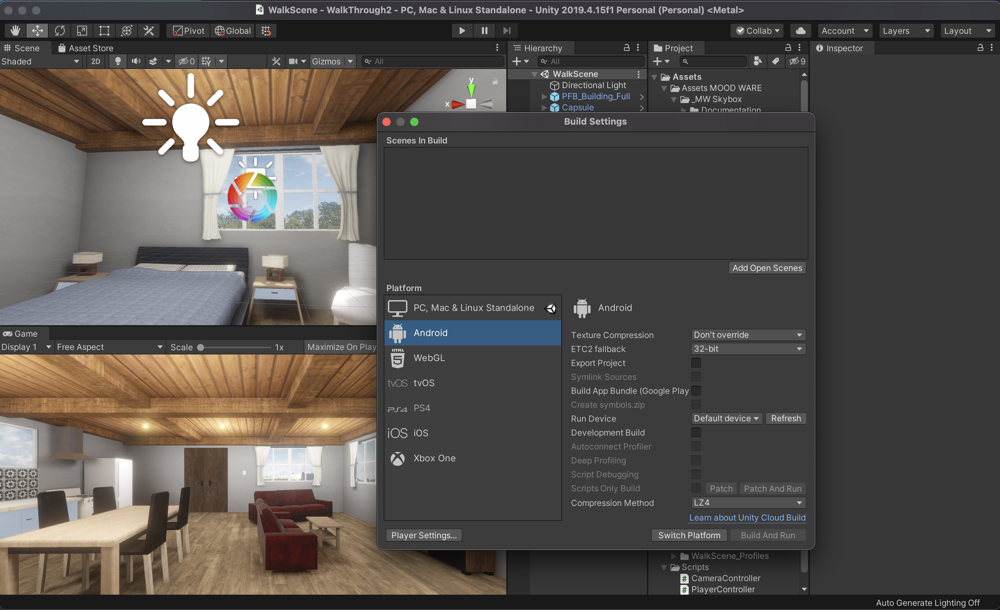
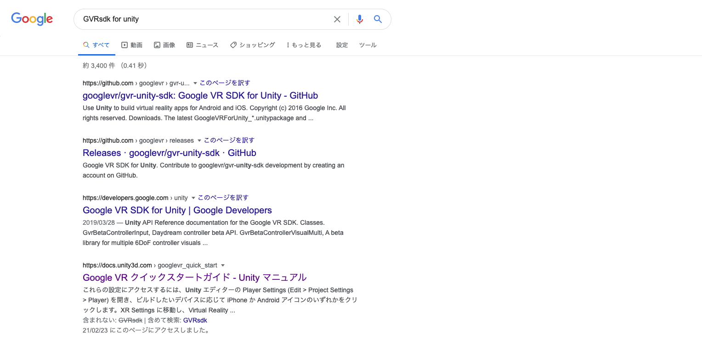
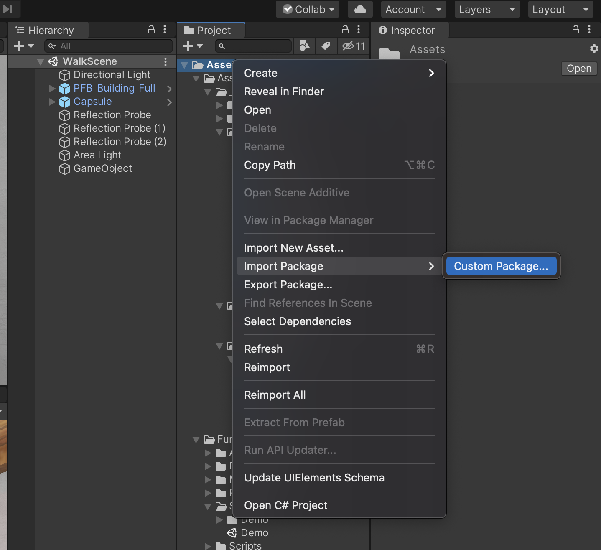
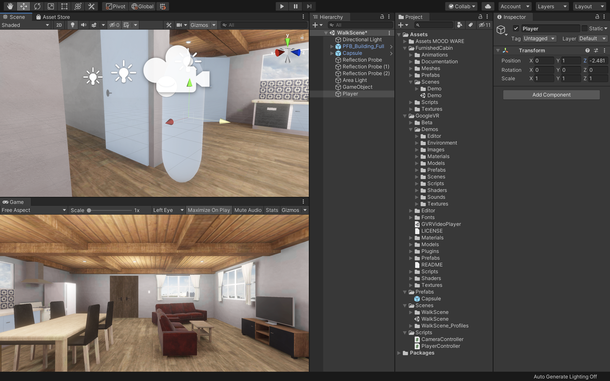
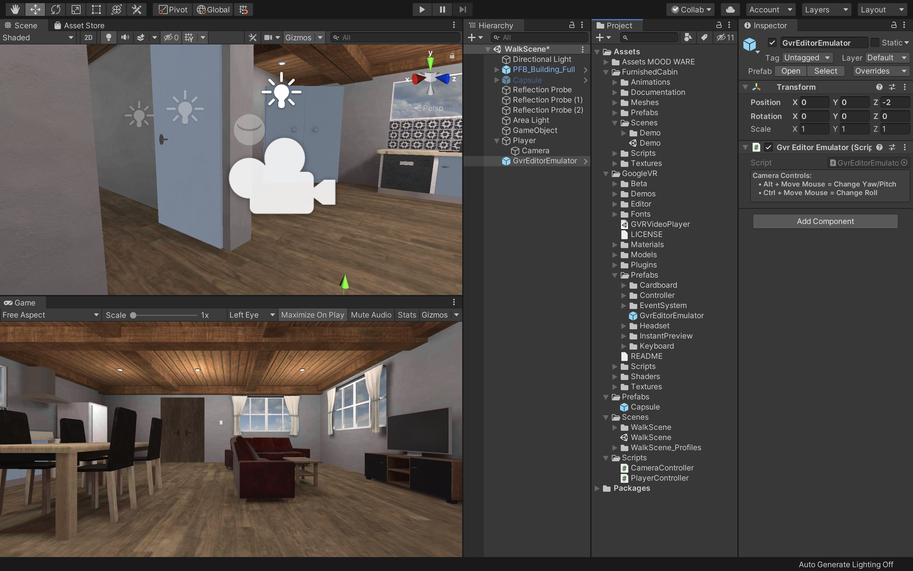

# Androidアプリとしてビルド

## Android Build Supportモジュールの追加

 

今回は前回までで作成した3Dオブジェクトを実際に実機（Android）へVRアプリとしてビルドする手順を解説していきます。

まずはUnityのプロジェクトをAndroid端末へビルドできるようにAndroidBuildSupportモジュールをインストールしましょう。  
最初にUnityHubを開きます。

 

UnityHubを開いたら、左側の「インストール」を選択し、自分が現在VRアプリ制作で使用しているUnityのバージョンを見つけます。  
Unityを１つしかインストールしていない場合はそちらを選択します。  
そして点線アイコンをクリックし、「モジュールを加える」をクリックしてください。

 

そうすると、このような画面が表示されます。
次にAndroidBuildSupportにチェックをつけて実行を選択してください。
既にチェックが入っていてインストール済みの場合はこちらの作業はしなくて大丈夫です。

実行すると、自動的にインストールが開始されます。  
重いファイルですのでダウンロードとインストールにしばらく時間がかかると思いますが、中断せず終了するまで待ちましょう。

 

## Android用にUnityの設定を変更する

AndroidBuildSupportモジュールのインストールが完了したら、プロジェクト画面からプロジェクトを開いてください。

プロジェクトを開いたら、「File -> Build&Settings」を開き、PlatformからAndroidを選択し、右下の「SwitchPlatform」を選択します。  

こちらはプロジェクトのサイズによって時間がかかる可能性があるのでしばらく待ちましょう。  
UnityのロゴマークがAndroidの横につけば完了です。  

 

### Cardboadをターゲットにする

次に「PlayerSettings」を開き、Playerから「XRSettings」の項目を開きます。  
そして、「Virtual Reality Supported」にチェックを入れ、VirtualRealitySDKsリストの「＋」アイコンをクリックし、リストに「Cardboad」を追加します。

そして、「DepthFormat」を「24-bit depth|8-bit stencil」にしてください。

DepthFormatは、Zバッファの深さを設定します。Unityは可視データをソートし、何が実際に画面にレンダリングされるかを決定します。

次にAPIレベルを調整します。  
Cardbordの最低限のプラットフォーム要件はAndroid5.0です。  
Unityが正しいAPKを使用し、Androidの最新バージョンにアップグレードしたデバイスでのみ実行されるようにするには、MinimumAPILevelを変更する必要があります。

 

まずはそのままOtherSettingsを開きます。  
そして、「GraphicsAPIs」のリストから「Vulkan」を削除してください。  

削除の方法はVulkanを選択し、下にある「ー」のアイコンをクリックするだけです。  
少し時間がかかるのですが、しばらく待っているとこちらのリストからVulkanが削除されます。

 

次にそのまま下にスクロールしていき、「MinimumAPILevel」と「TargetAPILevel」を確認してください。  
こちらのMinimumAPILevelが「Android4.4(APILevel19)」になっていることを確認してください。4.4以下の場合はこちらを修正します。  
また、TargetAPILevelが「Automatic」になっていることも確認してください。  

ここまで完了したらSetting画面を閉じましょう。

 

### GVR SDK for Unityをインポート

次にGoogleCardbordの開発キット「GVR SDK for Unity」をインポートします。

これを利用すると、スマートフォンでの再生や目線での衝突判定ができるようになります。

 

まずはブラウザで「GVR SDK for Unity」で検索してください。  
そうすると、おそらく一番上の方に「googlevr〜　GitHub」という名前のページが出てくると思いますのでそこにアクセスします。  

 

少し下にスクロールすると、このようなReadmeが出てくるのでDownloadsの項目にある「releases」のリンクをクリックしてください。

 

そうすると、ダウンロードページにいくので、そこから「GoogleVRForUnity_1.200.1.unitypackage」というアセットがあるのでそちらをクリックしてダウンロードしましょう。  

 

ダウンロードが完了したらUnityに戻り、プロジェクトウィンドウからAssetsフォルダを選択し、右クリックで「ImportPackage-> CustomPackage」を選択してください。

そして、先ほどダウンロードした「GoogleVRForUnity_1.200.1.unitypackage」を選択しOpenをクリックします。  

 

全てにチェックが入っていることを確認し、Importをクリックすると、インポートが始まりプロジェクトウィンドウに「GoogleVR」が追加されます。

    今回はこちらのGoogleVRSDKを利用しましたが、実は2019年年末以降に新規でCardbordSDKが発表され、現在はそちらに移行作業が進んでいます。
    もし今後もモバイルへのビルドを行う予定がある場合は、ぜひそちらも試してみましょう。

 

## VR用プレイヤーを作成

次にVR用のプレイヤー（視点操作）を作成します。

現在はCapsuleを十字キーで動かし、マウスで視点を変更していますが、モバイルでは端末の傾き・方向に合わせて視点を変更しなければならないのでそれ専用のプレイヤーを新規で作成していきたいと思います。

まずは新規で空のオブジェクトを作成し、名前を「Player」とします。

座標はCapsuleと同じ位置に配置してください。

 

次に新規でCameraを作成し、Playerの子要素にして座標をリセットしてください。

そしてCameraコンポーネントの「ClippingPlanes」の「Near」を「0.09」に変更してください。

ClippingPlanesは、レンダリングを開始及び停止するカメラからの距離のことで、Nearは描画が行われるカメラに最も近い点を指します。

 

次にプロジェクトウィンドウから「GoogleVR -> Prefabs -> GvrEditerEmulator」をヒエラルキーウィンドウにドラッグ&ドロップしてください。

この状態で一度実行してみましょう。

Altキーを押しながらマウスを動かすと視点が移動し、Ctrlキーを押しながらマウスを動かすと視点が回転するかと思います。

また、この時少し視点が低いと感じた場合はPlayerのY座標を少し上に修正してください。（1.7くらい）

 

## 視点で移動できるようにする

このままですと、同じ場所から移動できないので視点で移動できるようしたいと思います。

方法は簡単で、移動用のスフィアを作成し、視点がそのスフィアと重なった時にその場所へ移動するという仕組みを作りたいと思います。

 

まずはプロジェクトウィンドウから「GoogleVR -> Prefabs -> EventSystem -> GvrEventSystem」をヒエラルキーウィンドウにドラッグ&ドロップします。

次に「GoogleVR -> Prefabs -> Cardbord -> GvrReticlePointer」をヒエラルキーのCameraにドラッグ&ドロップして子要素にしてください。  
そしてGvrReticlePointerのPositionを全て０であることを確認し（０でなかったら０にしておく）、「Override Pointer Camera」の部分にヒエラルキーからCameraをドラッグ&ドロップしてください。

GvrEventSystemは視線の衝突判定でのイベントができるようになり、GvrReticlePointerはVR用視点の中心を点で表示させることができます。

 

次にヒエラルキーでCameraを選択し、インスペクターウィンドウから「Add Component -> Gvr Pointer Physics Raycast」を追加してください。

これで視点での衝突判定ができるようになりました。

特に問題がなければ忘れずに保存しておきましょう。
