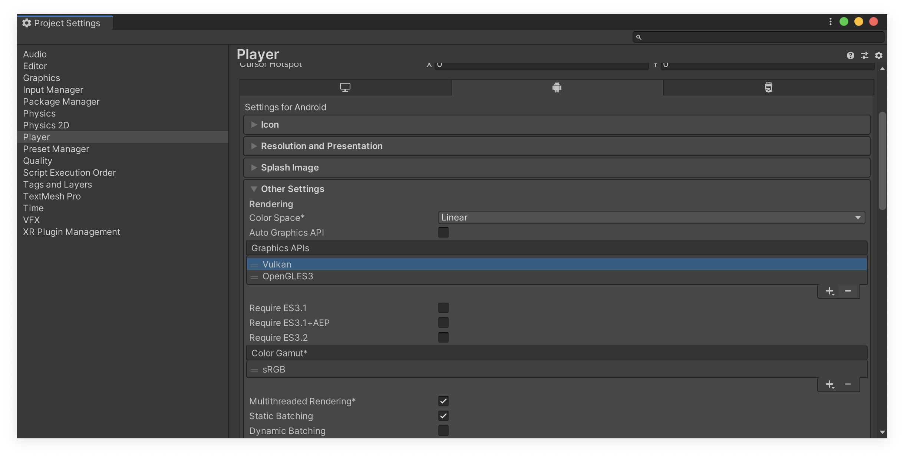
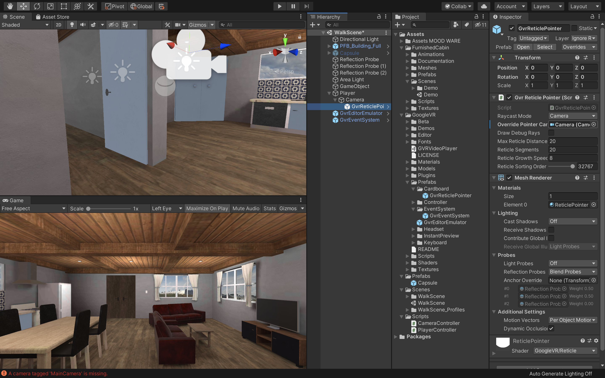
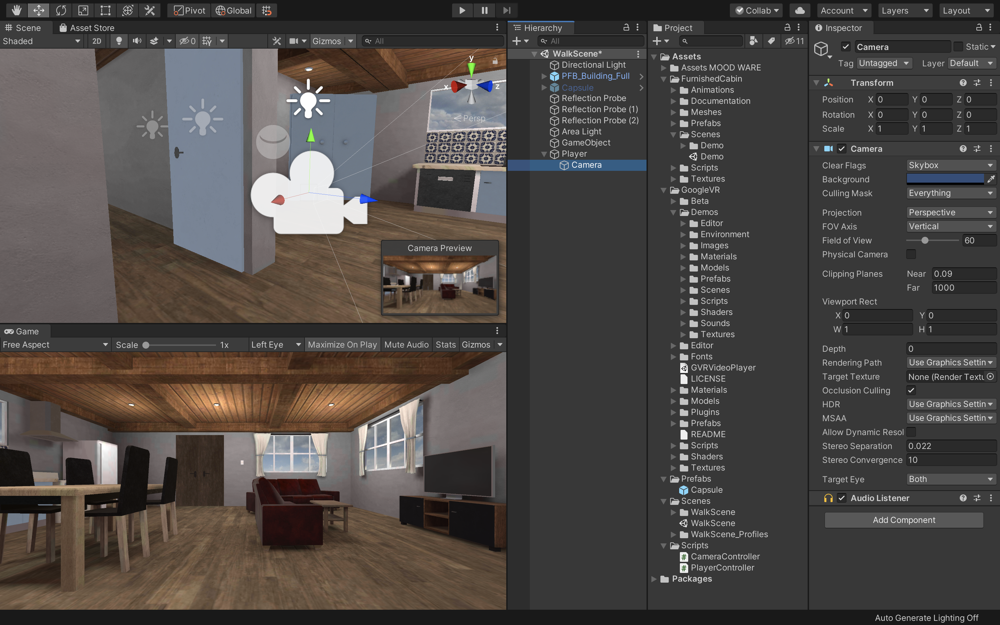

# Androidアプリとしてビルド

## Android Build Supportモジュールの追加

 

今回は前回までで作成した3Dオブジェクトを実際に実機（Android）へVRアプリとしてビルドする手順を解説していきます。

まずはUnityのプロジェクトをAndroid端末へビルドできるようにAndroidBuildSupportモジュールをインストールしましょう。  
最初にUnityHubを開きます。

 

UnityHubを開いたら、左側の「インストール」を選択し、自分が現在VRアプリ制作で使用しているUnityのバージョンを見つけます。  
Unityを１つしかインストールしていない場合はそちらを選択します。  
そして点線アイコンをクリックし、「モジュールを加える」をクリックしてください。

 

そうすると、このような画面が表示されます。
次にAndroidBuildSupportにチェックをつけて実行を選択してください。
既にチェックが入っていてインストール済みの場合はこちらの作業はしなくて大丈夫です。

実行すると、自動的にインストールが開始されます。  
重いファイルですのでダウンロードとインストールにしばらく時間がかかると思いますが、中断せず終了するまで待ちましょう。

 

## Android用にUnityの設定を変更する

AndroidBuildSupportモジュールのインストールが完了したら、プロジェクト画面からプロジェクトを開いてください。

プロジェクトを開いたら、「File -> Build&Settings」を開き、PlatformからAndroidを選択し、右下の「SwitchPlatform」を選択します。  

こちらはプロジェクトのサイズによって時間がかかる可能性があるのでしばらく待ちましょう。  
UnityのロゴマークがAndroidの横につけば完了です。  

 

### Cardboadをターゲットにする

次に「PlayerSettings」を開き、Playerから「XRSettings」の項目を開きます。  
そして、「Virtual Reality Supported」にチェックを入れ、VirtualRealitySDKsリストの「＋」アイコンをクリックし、リストに「Cardboad」を追加します。

そして、「DepthFormat」を「24-bit depth|8-bit stencil」にしてください。

DepthFormatは、Zバッファの深さを設定します。Unityは可視データをソートし、何が実際に画面にレンダリングされるかを決定します。

次にAPIレベルを調整します。  
Cardbordの最低限のプラットフォーム要件はAndroid5.0です。  
Unityが正しいAPKを使用し、Androidの最新バージョンにアップグレードしたデバイスでのみ実行されるようにするには、MinimumAPILevelを変更する必要があります。

 

まずはそのままOtherSettingsを開きます。  
そして、「GraphicsAPIs」のリストから「Vulkan」を削除してください。  

削除の方法はVulkanを選択し、下にある「ー」のアイコンをクリックするだけです。  
少し時間がかかるのですが、しばらく待っているとこちらのリストからVulkanが削除されます。

 

次にそのまま下にスクロールしていき、「MinimumAPILevel」と「TargetAPILevel」を確認してください。  
こちらのMinimumAPILevelが「Android4.4(APILevel19)」になっていることを確認してください。4.4以下の場合はこちらを修正します。  
また、TargetAPILevelが「Automatic」になっていることも確認してください。  

ここまで完了したらSetting画面を閉じましょう。

 

### ガンマとリニアの違いについて

ガンマとリニアについての違いはUnityに限った話ではなく映像や写真を仕事で扱う方は知識としてあると思います。

現在のUnityのプロジェクトでは滅多なことがない限り（ハードウェアがガンマ形式しかサポートしていないなど）基本的に「Linear」を使用します。

Unityにおける２つの違いについて詳しく知りたい方は[こちら](https://docs.unity3d.com/ja/2019.4/Manual/LinearRendering-LinearOrGammaWorkflow.html)の公式ドキュメントをご確認ください。

 

## ライトマップの作成

次に「Window -> Rendering -> LightingSettings」を開き、そのウィンドウの右下にある「Generate Lighting」ボタンを押してください。  
結構時間がかかるのですが、しばらく待っているとライトマップを作成することができます。

 

### ライトマップとは

ライトマップとは、高負荷である光と影の計算を事前に行い、その情報をテクスチャに書き込んでおく機能のことです。  
ライトマップを作成することにより実行時の負荷を軽くすることができます。

    ライトマッピングは、シーンのサーフェスの明るさを事前計算し、チャートやライトマップに結果を保存して後で使用するための処理です。

    Unity は プログレッシブライトマッパー と呼ばれるシステムを使用しています。プログレッシブライトマッパーは、メッシュ、マテリアル、テクスチャ、ライトを考慮しながら、シーンの設定に基づいてシーンのライトマップをベイクします。ライトマッピングはレンダリングエンジンの不可欠な部分です。ライトマップが作成されると、ゲームオブジェクトは自動的にそれらを使用します。

 

ここまでできたら実際に実行してみましょう。

デフォルトの状態よりもだいぶ明るい雰囲気になり、PCへの負荷も減ったかと思います。  
しかし、最初からついていたリフレクションプローブなども非アクティブにしたので鏡が反射しなくなっています。  
ですので、次はこちらを修正しましょう。

 

## リフレクションプローブを適用させる

ヒエラルキーウィンドウから新規で「ReflectionProbe」を作成してください。  
鏡からみた景色を表示したいので、位置を鏡と同じポイントにしてください。  
そしてLightingSettingsから「GenerateLighting」をクリックすると、きちんと鏡のリフレクションプローブが反映されました。  
実際に実行して確認してみましょう。

 

同様にバスルームの鏡用にもリフレクションプローブを作成し、GenerateLightingを実行してみましょう。

若干周りの背景に対して反射している背景が大きいように感じるので、そういった場合はReflectionProbeの「BoxProjection」にチェックを入れてください。  
BoxProjectionをOnにすると、カメラの位置が正しく考慮されて、家具などの写り込みの位置が正しく修正されます。

変更したらインスペクターウィンドウのReflectionProbeコンポーネントのBakeをクリックしておきましょう。

    Box Projection オプションを使うと、プローブから限定した距離でリフレクションキューブマップを作成することができます。そのため、オブジェクトはキューブマップの壁からの距離に応じて異なるサイズの反射を表示できます。 周囲のキューブマップのサイズは、Box Size プロパティで指定されたプローブの有効範囲によって決まります。例えば、部屋の内部を映すプローブは、部屋の大きさに合わせてサイズを設定する必要があります。 Project Settings__　> Graphics__　> Tier Settings で __Box Projection__　をグローバルに有効にすることができます。ただし、無限投影が望ましい場合、特定のリフレクションプローブに対して、Reflection Probe インスペクターでオプションをオフにすることができます。

 

最後に部屋全体にもReflectionProbeを適用させたいので部屋の中心に新規でReflectionProbeを作成し、BoxProjectionにチェックを入れBakeをクリックしてください。

 

これで、このような細かな家具にも反射が適用されました。

 

## SkyBoxを適用させる

窓の外が何もない空間なので、SkyBoxを変更して少し雰囲気を出したいと思います。  
AssetStoreを開き、検索バーに「skybox」と入力し検索してください。価格の部分で無料にチェックを入れると様々なSkyBoxが表示されると思いますので、任意のものを選択し、インポートしてください。  
教材では「3D Skybox Pro」というアセットをインポートしました。

 

アセットに入っているSkybox用のマテリアルをシーンビューの何もない場所にドラッグ&ドロップすると、このように窓の外の景色が変わるかと思います。

 

## ライティングの調整

既にライティングの設定が済んでいるアセットであればいいのですが、もしライティングがまだの場合は前回までの講習を参考に自分なりにライティングの設定をしてみましょう。  
ライトの色や強度を変えてみたり、自然光を増やしたりするのもいいと思います。ライティングに関してはセンスや慣れといった部分が強いと思いますので、何度も自分の納得のいくまでトライ&エラーを繰り返して学習してください。

現在のライティングの正確な見た目を確認したい時はLightingSettingsの「GenerateLighting」をクリックしてください。  

 

## エフェクトの追加

次にエフェクトを追加します。  
エフェクトの追加方法は以前の講習教材を確認してください。  
「Window -> PackageManager」から「PostProcessing」をインポートし、Cameraに「Post-processing」を追加し、Layerを「Default」に、  
新規オブジェクトを作成し、そちらに「Post-processVolume」をアタッチし、「IsGrobal」にチェックをつけて「New」を選択します。

ここまでできたらあとはお好きなエフェクトを追加していってください。

### エフェクトの種類

簡単にエフェクトの解説をしていきます。

#### AmbientOcclusion

オブジェクトの角や隅などに影を落として「現実」のように見せる画面エフェクト。  
部屋の隅などに影を落としてリアルな空間を演出できます。

#### AutoExposure

自動露出調整が可能なエフェクト。暗い部屋から明るい部屋に移動した際に起こる暗順応、明順応を表現できるエフェクトです。

#### Bloom

光を強調することのできるエフェクトです。暗い空間で特定の物を光らせたり、「ネオン」の表現が得意なエフェクトです。

#### ChromaticAberration

色収差を表現できるエフェクト

#### ColorGrading

色調補正機能

#### Depth of Field

現実のカメラで撮影したようなピントを表現できます。（被写界深度）

#### Grain

画面にノイズを付与できるエフェクトです。現実の暗い場所でノイズが乗りますがその効果を再現できます。

#### LensDistortion

レンズの歪みを再現できるエフェクトです。魚眼レンズのような表現ができます。

#### MotionBlur

動いている部分にブラーを付与するエフェクトです。スピード感などを表現するときに使用されます。

#### ScreenSpaceReflection

リアルタイムで物体の「反射」を表現できるエフェクトです。

#### Vignette

画面の端を暗くするエフェクトです。少しレトロな雰囲気を出したいときや空間を馴染ませる場合に使用します。

 

また、おそらくBloomをよく使用すると思うのですが、VR系のアプリを作る場合はBloomの「FastMode」にチェックを入れてください。  
これはBloomの描画クオリティを下げてパフォーマンスを優先にします。こちらにチェックを入れて特に問題がなければ基本的にチェックを入れておくようにしてください。

ここまで作り終わりましたらLightingSettingsの「GenerateLighting」をクリックして実際にシーンを実行して確認してください。

特に問題がなければ忘れずに保存しておきましょう。
