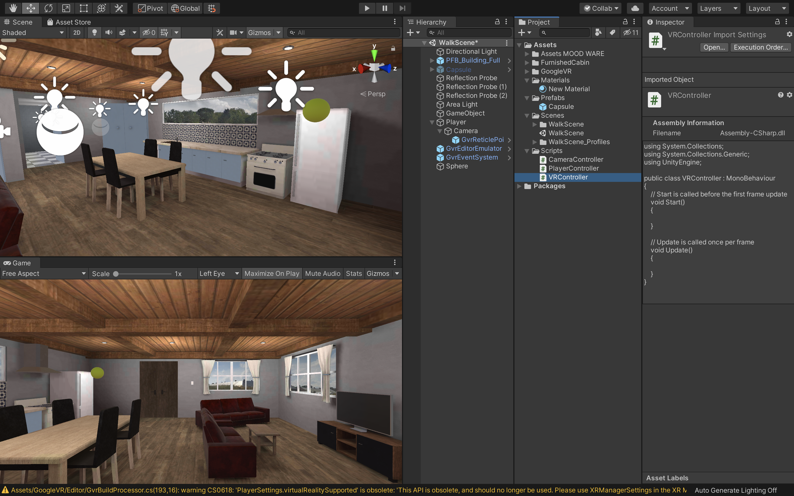

# VRメニューの作成

## 新規シーンの作成

<br>

今回は前回までに作成したVRアプリケーションにUIによる画面遷移機能の実装をしていきたいと思います。


まずは前回までに作成したUnityプロジェクトを開きましょう。

<br>


Unityのプロジェクトを開いたら、新規でシーンを作成し、名前を「TitleScene」としてください。  
シーンの作成方法などは前回までの教材を参考にしてください。

<br>


<br>


この状態だとCanvasが画面上に固定されているので、VRで左右を見ようとしてもCanvasが常に画面の中央についてきてしまいます。  
これを解消するために、CanvasのインスペクターウィンドウのCanvasコンポーネントの「Renderモード」を「World Space」に変更してください。

これでCanvasは初期の位置に固定され、左右を見回せるようになります。

<br>


まずはそのままOtherSettingsを開きます。  
そして、「GraphicsAPIs」のリストから「Vulkan」を削除してください。  

削除の方法はVulkanを選択し、下にある「ー」のアイコンをクリックするだけです。  
少し時間がかかるのですが、しばらく待っているとこちらのリストからVulkanが削除されます。

<br>


次にそのまま下にスクロールしていき、「MinimumAPILevel」と「TargetAPILevel」を確認してください。  
こちらのMinimumAPILevelが「Android4.4(APILevel19)」になっていることを確認してください。4.4以下の場合はこちらを修正します。  
また、TargetAPILevelが「Automatic」になっていることも確認してください。  

ここまで完了したらSetting画面を閉じましょう。

<br>

### GVR SDK for Unityをインポート

次にGoogleCardbordの開発キット「GVR SDK for Unity」をインポートします。

これを利用すると、スマートフォンでの再生や目線での衝突判定ができるようになります。

<br>


まずはブラウザで「GVR SDK for Unity」で検索してください。  
そうすると、おそらく一番上の方に「googlevr〜　GitHub」という名前のページが出てくると思いますのでそこにアクセスします。  

<br>


少し下にスクロールすると、このようなReadmeが出てくるのでDownloadsの項目にある「releases」のリンクをクリックしてください。

<br>


そうすると、ダウンロードページにいくので、そこから「GoogleVRForUnity_1.200.1.unitypackage」というアセットがあるのでそちらをクリックしてダウンロードしましょう。  

<br>


ダウンロードが完了したらUnityに戻り、プロジェクトウィンドウからAssetsフォルダを選択し、右クリックで「ImportPackage-> CustomPackage」を選択してください。

そして、先ほどダウンロードした「GoogleVRForUnity_1.200.1.unitypackage」を選択しOpenをクリックします。  

<br>


全てにチェックが入っていることを確認し、Importをクリックすると、インポートが始まりプロジェクトウィンドウに「GoogleVR」が追加されます。

<div class="warning">
    今回はこちらのGoogleVRSDKを利用しましたが、実は2019年年末以降に新規でCardbordSDKが発表され、現在はそちらに移行作業が進んでいます。
    もし今後もモバイルへのビルドを行う予定がある場合は、ぜひそちらも試してみましょう。
</div>

<br>

## VR用プレイヤーを作成

次にVR用のプレイヤー（視点操作）を作成します。

現在はCapsuleを十字キーで動かし、マウスで視点を変更していますが、モバイルでは端末の傾き・方向に合わせて視点を変更しなければならないのでそれ専用のプレイヤーを新規で作成していきたいと思います。


まずは新規で空のオブジェクトを作成し、名前を「Player」とします。

座標はCapsuleと同じ位置に配置してください。

<br>


次に新規でCameraを作成し、Playerの子要素にして座標をリセットしてください。

そしてCameraコンポーネントの「ClippingPlanes」の「Near」を「0.09」に変更してください。

ClippingPlanesは、レンダリングを開始及び停止するカメラからの距離のことで、Nearは描画が行われるカメラに最も近い点を指します。

<br>


次にプロジェクトウィンドウから「GoogleVR -> Prefabs -> GvrEditerEmulator」をヒエラルキーウィンドウにドラッグ&ドロップしてください。

この状態で一度実行してみましょう。

Altキーを押しながらマウスを動かすと視点が移動し、Ctrlキーを押しながらマウスを動かすと視点が回転するかと思います。

また、この時少し視点が低いと感じた場合はPlayerのY座標を少し上に修正してください。（1.7くらい）

<br>

## 視点で移動できるようにする

このままですと、同じ場所から移動できないので視点で移動できるようしたいと思います。

方法は簡単で、移動用のスフィアを作成し、視点がそのスフィアと重なった時にその場所へ移動するという仕組みを作りたいと思います。

<br>


まずはプロジェクトウィンドウから「GoogleVR -> Prefabs -> EventSystem -> GvrEventSystem」をヒエラルキーウィンドウにドラッグ&ドロップします。

次に「GoogleVR -> Prefabs -> Cardbord -> GvrReticlePointer」をヒエラルキーのCameraにドラッグ&ドロップして子要素にしてください。  
そしてGvrReticlePointerのPositionを全て０であることを確認し（０でなかったら０にしておく）、「Override Pointer Camera」の部分にヒエラルキーからCameraをドラッグ&ドロップしてください。

GvrEventSystemは視線の衝突判定でのイベントができるようになり、GvrReticlePointerはVR用視点の中心を点で表示させることができます。

<br>


次にヒエラルキーでCameraを選択し、インスペクターウィンドウから「Add Component -> Gvr Pointer Physics Raycast」を追加してください。

これで視点での衝突判定ができるようになりました。

<br>

### 視点移動させるスフィアの作成

次に視点が合ったらその場所に移動できるスフィアを作成します。

<br>


新規でスフィアを作成し、任意の場所に配置します。
そして大きさを全て0.4程度にしてください。

次に新規でマテリアルを作成し、Materialsフォルダを作成し格納します。  
色はなんでも構わないのですが、わかりやすい色にしておき、先ほど作成したスフィアにアタッチしてください。

<br>



次に、Scriptsフォルダの中に新規で「VRController」という名前のスクリプトを作成してVisualStudioで開きましょう。

そしてコードを以下のように変更してください。

```c#
using System.Collections;
using System.Collections.Generic;
using UnityEngine;

public class VRController : MonoBehaviour
{
    public GameObject player;
    public Camera mainCamera;
    private float timeCount;
    void Update()
    {
        RaycastHit hitObject;
        Ray ray = new Ray(mainCamera.transform.position, mainCamera.transform.forward);
        if (Physics.Raycast(ray, out hitObject))
        {
            if (hitObject.collider.CompareTag("Teleport"))
            {
                timeCount += 0.01f;
                if (timeCount > 2f)
                {
                    player.transform.position = new Vector3(hitObject.point.x, player.transform.position.y, hitObject.point.z);
                    timeCount = 0f;
                }
            }
            else
            {
                timeCount = 0f;
            }
        }
    }
}
```

上のコードの意味は若干複雑なので、簡単にどういう意味かを説明すると、「カメラの視点の先に「Teleport」という名前のタグがついたオブジェクトが合った場合、タイマーを加算し、もしタイマーの値が２以上になった場合はそのオブジェクトの場所にPlayerを移動させる」という意味になっています。

<br>


コードを保存したらUnityに戻り、GameObjectにVRControllerスクリプトをドラッグ&ドロップでアタッチしてください。

そしてGameObjectのVRControllerの項目のPlayerの部分にヒエラルキーからPlayerを、MainCameraの項目にPlayerの子要素のCameraをドラッグ&ドロップして入れてください。

<br>


次にSphereのインスペクターウィンドウから「Teleport」という名前のTagを新規で作成し、スフィアにつけてください。  
そしてそのスフィアを部屋の任意の場所に複製し、配置します。


これでポインター（視点）がスフィアと重なったタイミングでタイマーが動き、タイマーが２以上になった場合そこへテレポートするようになります。

こちらを保存して実行してみましょう。

画面に表示されている白い点をスフィアに一定時間合わせるとその場所にテレポートできているかと思います。

<br>

## 終了ポイントの作成

テレポートは完了したので、次はアプリケーションを終了させるオブジェクトを追加します。


まずは新規でCubeを作成し、名前を「Quit」としてください。  
次にそのCubeを任意の場所に配置してください。大きさも自由に変更してもらって構いません。

そしてMaterialを追加し、任意の色にします。

最後に「Quit」という新規タグを作成しこちらのCubeにつけてください。

<br>

次にVRControllerをVisualStudioで開き、コードを以下のように変更してください。

```c#
using System.Collections;
using System.Collections.Generic;
using UnityEngine;

public class VRController : MonoBehaviour
{
    public GameObject player;
    public Camera mainCamera;
    private float timeCount;
    void Update()
    {
        RaycastHit hitObject;
        Ray ray = new Ray(mainCamera.transform.position, mainCamera.transform.forward);
        if (Physics.Raycast(ray, out hitObject))
        {
            if (hitObject.collider.CompareTag("Teleport"))
            {
                timeCount += 0.01f;
                if (timeCount > 2f)
                {
                    player.transform.position = new Vector3(hitObject.point.x, player.transform.position.y, hitObject.point.z);
                    timeCount = 0f;
                }
            }
            else
            {
                timeCount = 0f;
            }
            if (hitObject.collider.CompareTag("Quit"))
            {
                Application.Quit();
            }
        }
    }
}
```


<br>

コードを変更したら保存してunityに戻りましょう。

カメラを新規で追加したのでPostProcessingが有効になっていないので、VR用のカメラの方にもPostProcessingLayerを追加してください。


<br>

## アプリケーションをモバイルにビルドする


ここまでできたら実際にモバイル端末にアプリケーションをビルドしてみましょう。

ScenesInBuildで現在のシーンを登録し、PlatformがAndroidであることを確認し右下の「Build」をクリックしてください。

ファイル名や保存場所を聞かれるので任意の名前・保存場所を選択し実行してください。

プロジェクトによっては少し時間がかかってしまいますがしばらく待っていると「(ファイル名).apk」というファイルが書き出されると思います。

<br>

### APKファイルをAndroidデバイスへインストールする

最後にこちらのapkファイルをAndroidデバイスへインストールしましょう。

インストール方法は色々あるのですが、メールで添付したり、GoogleDriveやDropBox等に入れてモバイルからダウンロードしたり、PCから直接コードを繋いでインストールする方法もあります。

一番やりやすい方法でチャレンジしてみましょう。

また、Android端末にGooglePlayStoreを通さないでアプリをインストールするには端末を開発者モードにする必要があります。

開発者モードにする方法については[こちら](https://appllio.com/android-development-mode-settings)を確認してください。

<br>


無事インストールが完了すると、このようにモバイルでVRアプリケーションを実行できるようになっているかと思います。

実際に動かしてみると開発中には見つからなかったバグや修正したほうがいい箇所なども見つかるので一度ビルドしたら終わりではなく、何度も実機で試してはUnityに戻って修正を繰り返してクオリティの高いアプリケーションにしていきましょう。